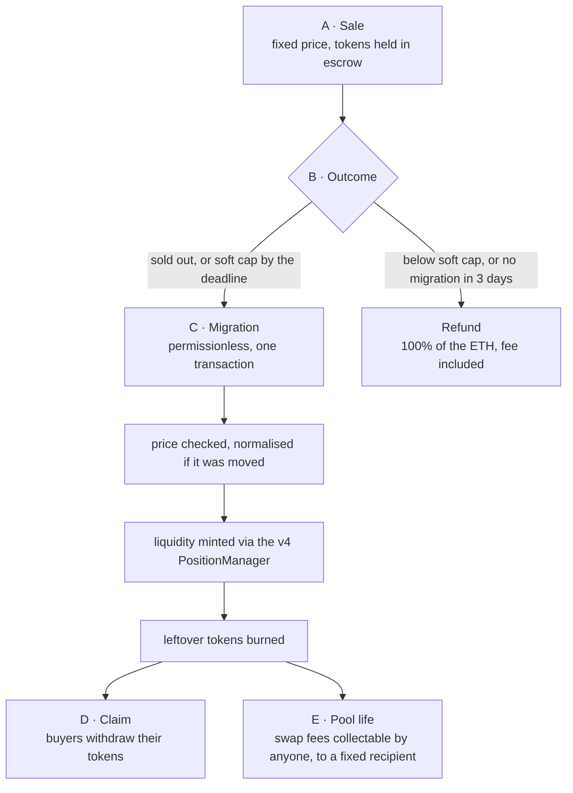

<div align="center">

# FixedSaleV4

**A token launch where the market is created by the contract, not promised by the team.**

[](https://github.com/arabafenice599rae/nuovo-token-/actions/workflows/ci.yml)
[](https://github.com/arabafenice599rae/nuovo-token-/actions/workflows/nightly.yml)


</div>

Tokens are sold at a fixed price. The moment the sale closes successfully, the
proceeds and the liquidity reserve move into a Uniswap v4 pool **at that same
price**, and the liquidity position stays with the contract forever.

|  |  |
| --- | --- |
| Sale price = market opening price | the migration reverts if the pool is not exactly at the listing price |
| Liquidity cannot be pulled | no function transfers the position NFT or decreases liquidity |
| No team allocation, no mint | supply is sale + liquidity; whatever is left over is burned |
| A failed launch returns everything | 100% of the ETH paid, fee included |
| No owner, admin, pause or upgrade | there is no privileged role to compromise |

→ **[What this launch is for](docs/overview.md)** — objective, mechanics, figures, and the limits stated as plainly as the guarantees.

## How it works



## Launch parameters

|  |  |
| --- | --- |
| Total supply | **100,000,000** tokens (exact) |
| On sale | 52,631,578.947368421052631579 |
| Liquidity reserve | 47,368,421.052631578947368421 |
| Price | 0.00001 ETH per token |
| Soft cap | 26,315,789.47 (50%) · 7 days |
| Raised at full sale | 526.32 ETH → 52.63 fee + 473.68 into the pool |
| Pool opening price | 0.00001 ETH (tick 115,135) |

The reserve is 90% of what is sold, so the minted supply is 19/10 of the sale
supply — an exact 100,000,000 total means selling 100M × 10/19. Parameters live
in [`script/Deploy.s.sol`](script/Deploy.s.sol); PoolManager and PositionManager
addresses are passed through the environment, never hardcoded.

## Quick start

```bash
make install       # pinned dependencies (git submodules)
make build         # forge build --sizes
make test          # 20 tests: paths, fuzz, invariants
make analyze       # build + Slither + Aderyn
make serve         # the frontend on :8080
make ci            # the full pull-request pipeline, locally
make help          # every target
```

Requires [Foundry](https://getfoundry.sh) 1.8.1 (solc 0.8.26, fetched by
`forge`), [Slither](https://github.com/crytic/slither) 0.11.6 and
[Aderyn](https://github.com/Cyfrin/aderyn) 0.6.8 — install commands in
[docs/static-analysis.md](docs/static-analysis.md), versions checked with
`make versions`.

## Frontend

[`frontend/`](frontend/) is a single static page to read the sale, buy, claim
and refund. **Zero dependencies, no build step** — four files, so there is no
npm tree to audit on a page that asks people to sign transactions.

|  |  |
| --- | --- |
| No network requests of its own | `connect-src 'none'`; every read and write goes through the wallet |
| Strict CSP | `default-src 'none'`, no inline script, no `eval`, no `innerHTML` |
| No approvals, ever | the sale takes native ETH — the most abused signature never appears |
| Chain and address guards | `eth_chainId` and `eth_getCode` are checked before any transaction |
| Selectors cannot drift | `make check-selectors` verifies them against the compiled contract, in CI |
| Money never touches a float | `BigInt` end to end, mirroring the contract's own arithmetic |

Full threat model and deployment notes: [frontend/README.md](frontend/README.md).

## Testing

20 tests, all green, against **real** Uniswap v4 contracts — a real PoolManager
and PositionManager, no mocks, with permit2 etched from its precompiled
bytecode.

|  |  |
| --- | --- |
| Path tests | 14 — sold-out lifecycle, refunds, normalisation after a free move, crossing hostile liquidity, fee collection, entry guards, tick saturation cost |
| Invariants | I1–I5, I9, I12 over 1,000 runs × depth 150 = **150,000 calls** |
| Coverage of `src/FixedSaleV4.sol` | 97.50% lines · 100% functions · 63.04% branches |

Every invariant I1–I13 declared in the contract header has a check behind it;
the invariant → test map is in [docs/testing.md](docs/testing.md).

## Static analysis

| Gate | State |
| --- | --- |
| Slither (`fail_on: medium`) | 0 findings at medium or above |
| Aderyn (`tools/aderyn-gate.sh`) | 0 High findings |
| forge lint | informational, does not gate the build |

Every blocking finding is triaged one by one in
[docs/findings.md](docs/findings.md), with the reason and the exact place it is
suppressed. The remaining low and informational findings stay visible on every
run.

## CI

Three jobs on every push and pull request — build & test, Slither, Aderyn
(report uploaded as an artifact) — plus a nightly campaign at 03:00 UTC with the
`ci` profile (20k fuzz runs). The ruleset intended for `main` lives in
[`.github/rulesets/main.json`](.github/rulesets/main.json) and can be applied
from **Actions → Apply ruleset → Run workflow**. Note that GitHub does not
enforce rulesets on a private repository under a personal account: see
[docs/branch-protection.md](docs/branch-protection.md) for what that means and
the three ways to get real enforcement.

<details>
<summary><strong>Repository layout</strong></summary>

```
src/            FixedSaleV4.sol — LaunchToken and FixedSaleV4
test/           path tests, invariant handler, shared fixture
script/         deploy script carrying the launch parameters
frontend/       static page: read the sale, buy, claim, refund
lib/            dependencies, pinned as submodules
tools/          CI gates (aderyn-gate.sh, check-deps.sh, check-selectors.sh)
docs/           overview, dependencies, static analysis, findings, testing
foundry.toml    compiler profiles (default / ci / lite)
remappings.txt  import remappings into lib/
```

</details>

## Documentation

| Document | Contents |
| --- | --- |
| [overview.md](docs/overview.md) | what the launch guarantees, how, and what it does not promise |
| [dependencies.md](docs/dependencies.md) | pinned commits, remapping rationale, upgrade procedure |
| [testing.md](docs/testing.md) | suite, invariant coverage, behaviours the tests surfaced |
| [findings.md](docs/findings.md) | static-analysis triage and active suppressions |
| [static-analysis.md](docs/static-analysis.md) | tool setup and triage workflow |
| [branch-protection.md](docs/branch-protection.md) | the `main` ruleset and how to apply it |
| [frontend/README.md](frontend/README.md) | frontend security model and deployment |

## Security

This code has **not been audited**. The Uniswap v4 integration is custom glue
code and needs independent review before it handles real funds. The static
analysis and the test suite in this repository raise the floor; they are not a
substitute for a review.
